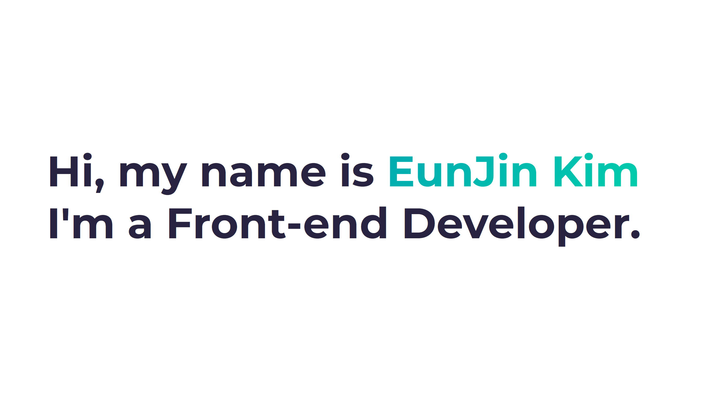

<!--  -->

### Kim EunJin 👩‍💻👩 
  
[🙋🏻‍♀️ Resume](https://www.notion.so/fedev-genie/Frontend-Developer-ef3b503fcd0d4ac4973d384769af684d?pvs=4) 
[💻 My Blog](https://eunjin0212.github.io/)   
 
 
 
